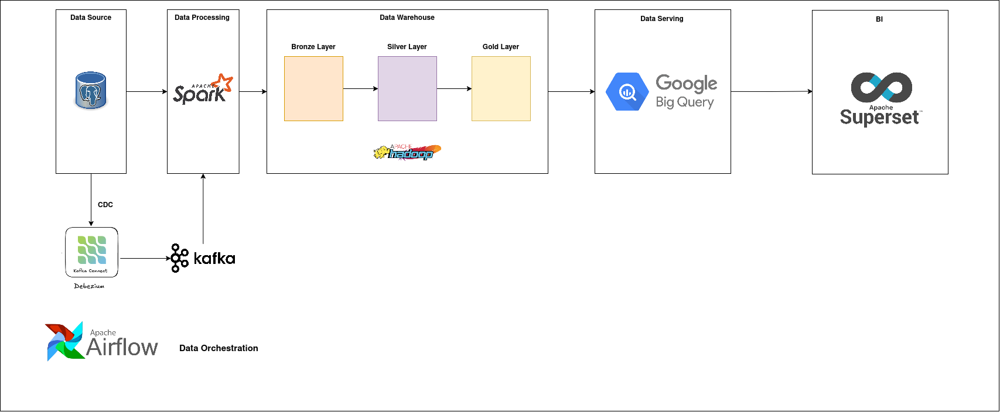

# Ecommerce Data Warehouse Platform

## 🚀 Project Overview
Engineered a scalable data platform using Spark and Hadoop to solve critical production latency issues. By implementing advanced Spark optimizations, I reduced pipeline execution time.

Also, I architected the end-to-end flow from on-prem ingestion to BigQuery, utilizing Airflow for orchestration and Apache Superset for real-time business intelligence

## 🏗️ Data Warehouse Architecture

  

## 🛠️ Engineering Solutions

## 📈 Impact
* Accuracy: Eliminated data duplications issues in financial reporting
* Performance: Reduce BigQuery scan costs by pre-filtering and optimizing SQL Lab queries.

