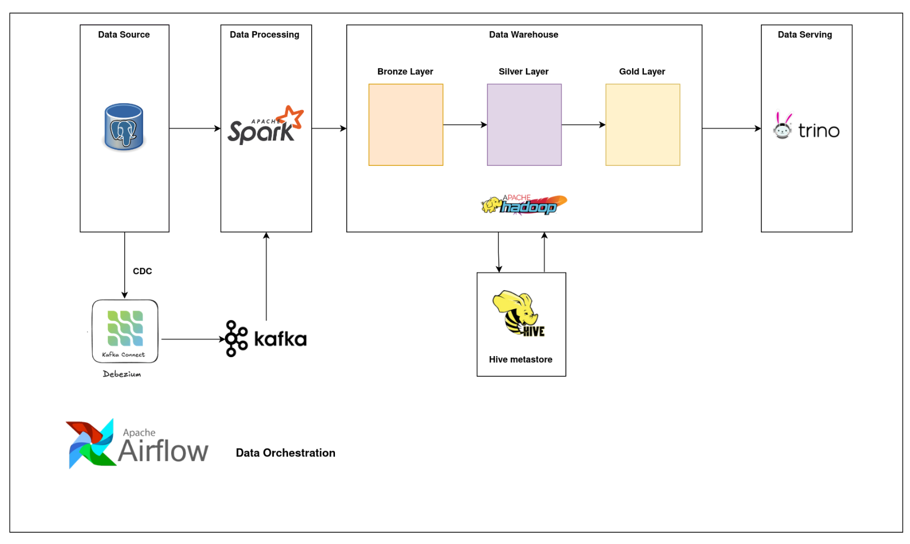
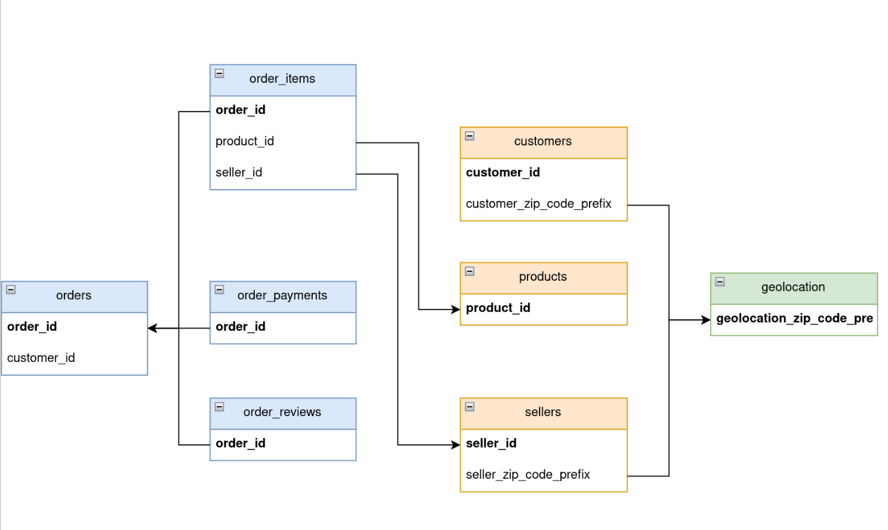
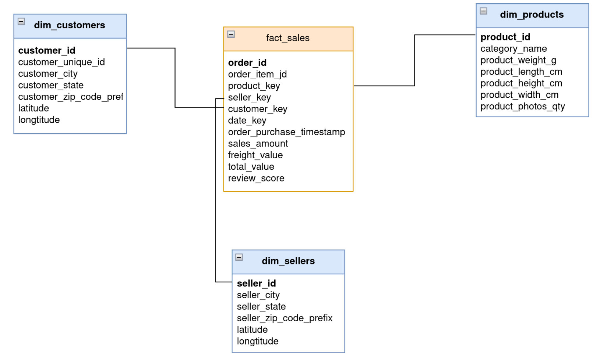
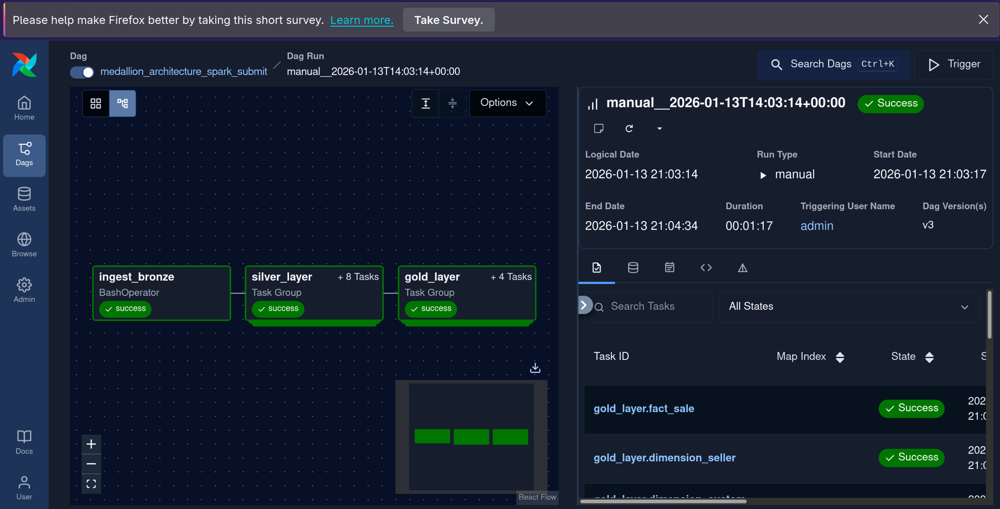

# Data Warehouse Platform

## Description
* A production-oriented Data Warehouse Platform implementation demonstrating a medallion architecture and end-to-end ingestion 
* **Big Data tools**: Apache Hadoop, Apache Spark, Hive, Trino, Debezium, Apache Kafka and Apache Airflow.
* This repository contains DAGs, ETL code, and data used while building a Medallion-style data lake and a queryable data warehouse backed by Hive metastore and Trino.

## Data Warehouse Architecture

  

## Project summary
This project demonstrates:
- Change-data-capture (CDC) ingestion using Debezium and Kafka.
- Near-real-time processing with Spark Structured Streaming to write into the data lake (bronze/silver/gold).
- Batch ingestion using **Spark** and orchestration using **Apache Airflow**.
- Metadata management with Hive metastore and interactive querying using Trino.
- Medallion architecture (bronze / silver / gold) for progressive refinement of data.

## Components
- **Apache Hadoop (HDFS)** : Storage for data lake layers.
- **Apache Kafka** : Message bus for CDC and streaming.
- **Debezium** : Sources changes from databases and writes to Kafka.
- **Apache Spark** : Stream and batch processing (Structured Streaming, Spark SQL).
- **Apache Airflow** — orchestration of batch pipelines and scheduling.
- **Hive Metastore** — table metadata for files stored in the data lake.
- **Trino** — interactive SQL engine for analytics.

## Project file structure (high level)
- `dags/` — Airflow DAG definitions used to orchestrate pipelines
- `data/` — sample CSVs and datasets used for demonstration and tests
- `main/`
  - `bronze_layer/` — raw ingested data (example outputs)
  - `silver_layer/` — cleaned/curated data
  - `gold_layer/` — aggregated/denormalized tables for analytics
- `src/` — ETL scripts, Spark jobs, helpers
- `SQL/` — reusable SQL queries (for Trino/Hive)
- `requirement.txt` — Python dependencies
Medallion architecture (how it's applied)

## Pipeline
### Batch Pipeline
**Target:** Low-velocity reference tables that define business entities.
* Tables like `products` and `sellers` are relatively static. Modifications (such as a product category change or a seller moving to a new city) are rare. Streaming these tables provides diminishing returns and adds unnecessary complexity.

**Implementation Goals**
* **Efficiency:** High-throughput bulk loads are performed during off-peak hours (e.g., nightly).
* **Incremental Load**: We only ingest modified data by evaluating columns `created_at` and `updated_at`
### CDC Pipeline
**Target:** High-velocity tables with frequent `INSERT` and `UPDATE` operations.
* Transactional tables like `orders` undergo a lifecycle of state changes (e.g., *Created* → *Paid* → *Shipped*). A standard Batch approach would only capture the **final state** at the end of the day, losing critical intermediate data.

**Implementation Goals**
* **Capture Every Event:** We ingest the database transaction logs (Binlogs/WAL) to capture every single state transition.
* **Immediate Consistency:** Allows the platform to support real-time operational use cases, such as fraud detection (e.g., rapid failures in `order_payments`) and live order tracking dashboards.
* **Immutable History:** In the Data Lake/Warehouse, these changes are stored as an append-only log of events, preserving the full history of the order lifecycle.

## Medallion Architecture
- **Bronze**: raw event-level data from CDC or batch sources.
- **Silver**: cleaned and conformed records (joins, type normalization, deduplication).
- **Gold**: business-level aggregates and wide tables designed for analytics and BI.

## Data Modeling

* PostgreSQL database stores 8 tables with their schemas:

  

* Star Modeling

  

## Data Orchestration

  

